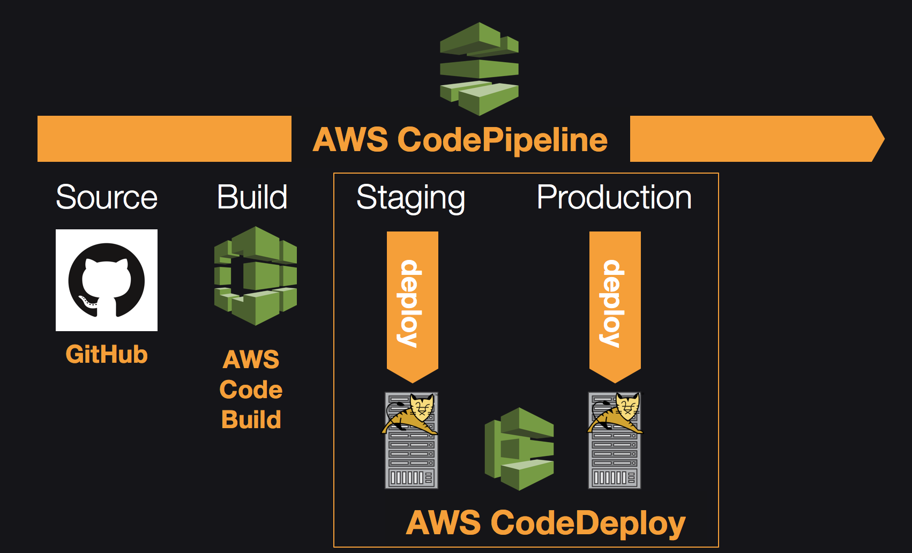
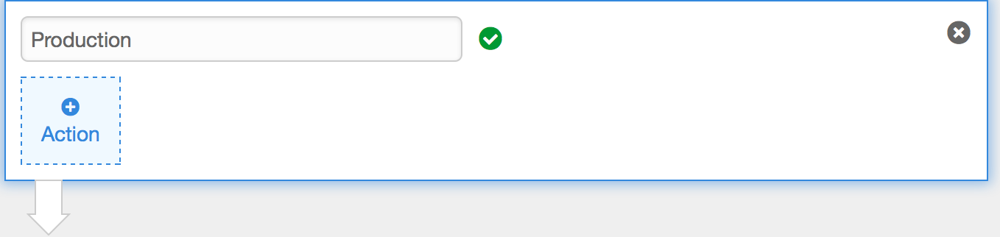
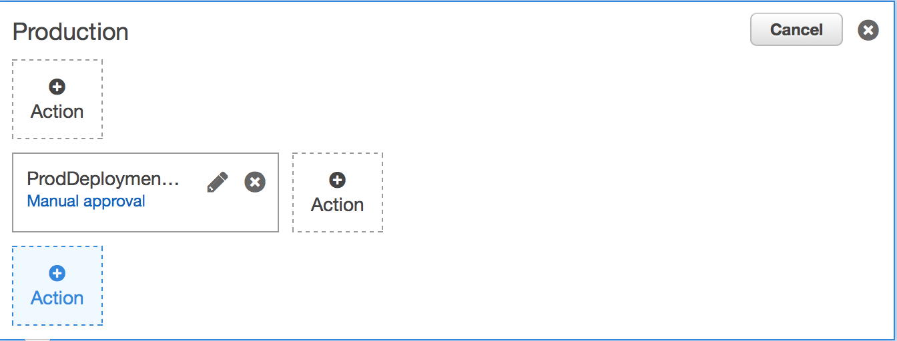
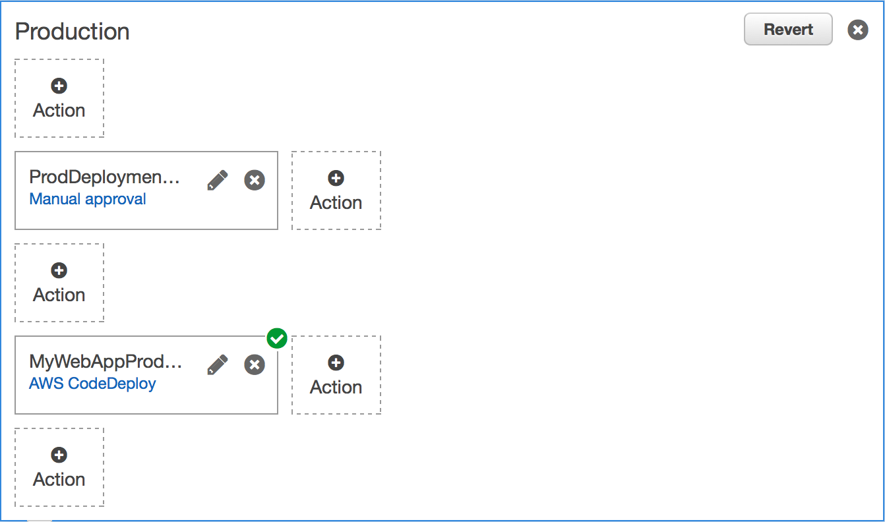
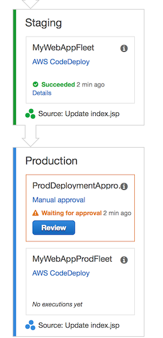

# AWS DevOps Workshop
This workshop will guide you to build and deploy a sample JAVA Web Application hosted on Apache Tomcat Web Server through AWS CI/CD tools including CloudFormation, CodeBuild, CodeDeploy, and CodePipeline.    

## Prerequisites

### AWS Account

In order to complete this workshop you'll need an AWS Account with access to create **AWS IAM, CodeBuild, CodeDeploy, CodePipeline**. The code and instructions in this workshop assume only one student is using a given AWS account at a time. If you try sharing an account with another student, you'll run into naming conflicts for certain resources. You can work around these by appending a unique suffix to the resources that fail to create due to conflicts, but the instructions do not provide details on the changes required to make this work.

All of the resources you will launch as part of this workshop are eligible for the AWS free tier if your account is less than 12 months old. See the [AWS Free Tier page](https://aws.amazon.com/free/) for more details.

### GitHub Account
You need your own GitHub account to complete this workshop. If you don't have one, create new one at [https://github.com](https://github.com)

## Implementation
### Fork GitHub Repository
- Login to your GitHub Console

- Navigate to this workshop repo: [https://github.com/marvelousgame/aws-devops-workshop](https://github.com/marvelousgame/aws-devops-workshop)

- Click **Fork** (at top right) to have your own copy of this repo

- On the following implementation, you will access and work your own copy of this repo. (ex. https://github.com/your-github-username/aws-devops-workshop)
 
---

### Login to AWS Console
- Go to your AWS Console

- Login as IAM user which have enough privilege

- Select AWS region: **N.Virginia**      

---

### Create EC2 Key Pair
You can skip below steps if you already have existing **EC2 Key Pair** in **N.Virginia**.

-  From the AWS Management Console, choose **Services** then select **EC2** under Compute.

- Click **Create Key Pair**

- Specify **Key Pair Name**, click **Create**

- Save the **.pem** file to your local folder

---

### Using CloudFormation to Create CodeDeploy Environment

At this step, you will launch ELB, Auto Scaling Group and EC2 instances as your deployment target.

- Download and save CloudFormation template [codedeploy-cloudformation.json](codedeploy-cloudformation.json) to your local computer

- This CloudFormation template will generate AWS resources for you.

- From the AWS Management Console, choose **Services** then select **CloudFormation** under Management Tools.

- Click **Create stack** on the top left page

- On **Choose a template**, choose **Upload a template to Amazon S3**, click **Browse** and select *codedeploy-cloudformation.json* that you downloaded before

- Click **Next**

- For **Stack name**, type `CodeDeployStack`

- For **Instance Count**, leave it as default (1)

- For **Key pair name**, choose from one of your key pair 

- For **LoadBalancerName**, type `MyWebAppLoadBalancer`

- For **ServiceRoleName**, type `MyWebAppCodeDeployServiceRole`

- For **SSHLocation**, leave it as default (0.0.0.0/0)

- Click **Next**

- On **Options** page, click **Next**

- On **Review** page, check the option **I acknowledge that AWS CloudFormation might create IAM resources with custom names.**

- Click **Create**

- You can view the progress from CloudFormation template.

- Wait until the status is **CREATE_COMPLETE** (takes around 5 minutes). 

---

### Create CodeDeploy Project

- From the AWS Management Console, choose **Services** then select **CodeDeploy** under Developer Tools.

- If this is your first time using CodeDeploy, click **Get Started Now**, choose **Custom deployment**, choose **Skip Walkthrough**

- Otherwise click **Create application**

- For **Application name**, type `MyWebApp`

- For **Deployment Group name**, type `MyWebAppFleet`

- For **Deployment type**, choose **In-place deployment**

- On **Search by tags** section, for **Tag type** choose **Auto Scaling Group** 

- For the combo box selection, choose value starts with  **CodeDeployStack-MyWebAppAutoScalingGroup**

- For **Load balancer**, choose **MyWebAppLoadBalancer**

- For **Service role ARN**, type `MyWebAppCodeDeployServiceRole`, and choose the role ARN from the combo box (ex. arn:aws:iam::xxxxxxx:role/MyWebAppCodeDeployServiceRole)

- Click **Create Application**

- CodeDeploy create `MyWebApp` Application with the `MyWebAppFleet` DeploymentGroup

- Take a note of your web application ELB end point (ex http://MyWebAppLoadBalancer-xxxxxxxxxx.us-east-1.elb.amazonaws.com)
	- How to get ELB endpoint: Go to EC2 -> Load Balancer -> select **MyWebAppLoadBalancer**, in the lower level pane, locate the **DNS name**

- If you trying to use web browser to access the endpoint, it will show you "Server Not Found" page, since we haven't deploy our web application yet.
	 
---

### Create CodePipeline

- From the AWS Management Console, choose **Services** then select **CodePipeline** under Developer Tools.

- If this is your first time working with CodePipeline, click **Get started**, otherwise choose **Create pipeline**

- For **Pipeline name**, type `MyWebApp_pipeline`, click **Next Step**

- In **Source location** page
	- For **Source provider**, choose **GitHub**
	- Click **Connect to GitHub**
	- If you haven't login to GitHub, system will redirect you to new window. Click **Authorize** button if necessary or type your user login information and click **Sign in**. It will redirect you back to CloudPipeline page
	- For **Repository**, choose your own previously created  repo (ex. \<your-github-username>/aws-devops-workshop)
	- For **Branch**, choose **master**
	- Click **Next Step**

- In **Build** page
	- For **Build provider**, choose **AWS CodeBuild**
	- On **Configure your project**, choose **Create a new build project**
	- For **Project name**, type `MyWebApp`
	- For **Environment image**, choose **Use an image managed by AWS CodeBuild**
	- For **Operating system**, choose **Ubuntu**
	- For **Runtime**, choose **Java**
	- For **Version**, choose version ends with **openjdk-8**
	- For **Build specification**, choose **Use the buildspec.yml in the source code root directory**
	- For **AWS CodeBuild service role**, choose **Create a service role in your account**
	- For **Role name**, type `code-build-MyWebApp-service-role` (this might already populated for you)
	- Click **Save build project**
	- Click **Next Step**

- In **Deploy** page
	- For **Deployment provider**, choose **AWS CodeDeploy**
	- For **Application name**, choose `MyWebApp`
	- For **Deployment group**, choose value which begins with `MyWebAppFleet`
	- Click **Next Step**

- In **AWS Service Role**
	- For **Role name**, click **Create role** button
	- It will redirect to IAM Console
	- For **Role name**, replace the value with  `MyWebAppPipelineRole`
	- Click **Allow**
	- It will redirect back to CodeDeploy Console with the role name is populated in the textbox
	- Click **Next step**

- In **Review your pipeline** page, click **Create pipeline**
	- Note that CodePipeline will create an Amazon S3 bucket to store artifacts for this pipeline. (ex.  s3://codepipeline-us-east-1-xxxxxxxxxxxx/)

- Your pipeline will be created.

- Wait couple of seconds, then your pipeline will be triggered. Pipeline: Source -> Build -> Staging.

- While the pipeline is running, you can view each detail on every pipeline stage.

- Wait until the pipeline completed (around 5 minutes)

- Open your browser and access web application using ELB end point (ex http://MyWebAppLoadBalancer-xxxxxxxxxx.us-east-1.elb.amazonaws.com).

---

### Change Source Code and Trigger Pipeline

Now you will change and commit the source code in GitHub, which will automatically trigger CodePipeline to build and deploy your application.

- Login to your GitHub 

- Locate **index.jsp** in your repo (https://github.com/your-user-name/aws-devops-workshop/blob/master/src/main/webapp/WEB-INF/pages/index.jsp)
	- replace \<your-user-name> with yours

- Click **Edit this file** icon at the top right of the page (pencil icon)

- Navigate to subheader (line 86), change the content to something else.
	- Or you can change other line as you want.

- Enter optional commit message and description (ex. Update index.jsp)

- Click **Commit changes**

- Go back to **CodePipeline** ` MyWebApp_pipeline` page

- You will find out the pipeline is triggered.

- Wait until the pipeline completed (around 5 minutes)

- Open your browser and access web application using ELB end point

- You can changes has been deployed to your environment.

---

# Add Production Environment in CodePipeline Stage

Currently the pipeline have source, build, and staging environment. We will add production environment where there are manual approval before the pipeline deploy your updated web application to production environment using Blue/green deployment.

### Using CloudFormation to Create Production CodeDeploy Environment

- Repeat the step **Using CloudFormation to Create CodeDeploy Environment** with the same [cloudformation template](codedeploy-cloudformation.json) and below configuration

	- For **Stack name**, type `CodeDeployProdStack`

	- For **Instance Count**, leave it as default (1)

	- For **Key pair name**, choose from one of your key pair 

	- For **LoadBalancerName**, type `MyWebAppProdLoadBalancer`

	- For **ServiceRoleName**, type `MyWebAppProdCodeDeployServiceRole`

	- For **SSHLocation**, leave it as default (0.0.0.0/0)

- Take a note of your web application production ELB end point (ex http://MyWebAppProdLoadBalancer-xxxxxxxxxx.us-east-1.elb.amazonaws.com)

- If you trying to use web browser to access the endpoint, it will show you "Server Not Found" page, since we haven't deploy our web application yet.

---

### Create SNS Topic Subscription

- From the AWS Management Console, choose **Services** then select **Simple Notification Services** under Messaging. 

- If this is your first time working with SNS

- From **SNS Dashboard**, choose **Create topic**

- For **Topic name**, type `MyWebAppProdDeployment`

- Click **Create topic**

- Your topic will be created

- Click the **ARN** URL

- Click **Create Subscription**

- For **Protocol**, choose **Email**

- For **Endpoint**, type your email address that you have the access to.

- Click **Create subscription**

- A confirmation message will be sent to your email. Check your email address.

- On the email message, click **Confirm subscription** 

- Go back to the SNS, and your email has been successfully subscribed to this topic (have **Subscription ID**)

---

### Create CodeDeploy DeploymentGroup for Production

- From the AWS Management Console, choose **Services** then select **Code Deploy** under Developer tools.

- Choose **MyWebApp**

- Click **Create deployment group**

- For **Deployment group name**, type `MyWebAppProdFleet`

- For **Deployment type**, choose **Blue/green deployment**

- Make sure that **Automatically copy Auto Scaling group** is selected

- For **Auto Scaling group**, choose value begins with **CodeDeployProdStack-MyWebAppAutoScalingGroup**

- For **Load Balancer**, choose **MyWebAppProdLoadBalancer** (this may be auto populated for you)

- On **Deployment settings**, there is message showing that it will terminate original instances in the deployment group after **0 days 1 hours 0 minutes**

- For this time, we want to change it, in the option *Want to use different settings?*, click __*Edit deployment settings*__

- Scroll down to bottom, make sure that **Terminate the original instances in the deployment group** is selected, and specify **Wait time 0 days 0 hours 0 minutes**

- Click **Submit**

- The message has changed, showing that it will terminate original instances in the deployment group after **0 days 0 hours 0 minutes**

- On **Service Role**, for **Service ARN**, type `MyWebAppProdCodeDeployServiceRole`, and choose the role from the combo box

- Click **Create deployment group**

---

### Modify CodePipeline - Add Manual Approval and Production Stage

- From the AWS Management Console, choose **Services** then select **Code Pipeline** under Developer tools.

- Click **MyWebApp_pipeline**

- Click **Edit**

- At the very bottom of the pipeline, click **+Stage** 

- Enter stage name: `Production`

- Click **+Action** from the bottom of the stage

- For **Action category**, choose **Approval** from dropdown box

- For **Action name**, type `ProdDeploymentApproval`

- For **Approval type**, choose **Manual approval** from dropdown box

- For **SNS topic ARN**, type `MyWebAppProdDeployment`, and choose the ARN (ex. arn:aws:sns:us-east-1:xxxxxxxxxxxx:MyWebAppProdDeployment)

- For **URL for review**, type the staging ELB end point that you grab before (ex. http://MyWebAppLoadBalancer-xxxxxxxxxx.us-east-1.elb.amazonaws.com)

- For **Comments**, type `Please review the deployment`

- Click **Add action** button

- New action called `ProdDeploymentApproval` created for you

- Click **+Action** under the `ProdDeploymentApproval` action

- For **Action category**, choose **Deploy**

- For **Action name**, type `MyWebAppProdFleet`

- For **Deployment provider**, choose **AWS CodeDeploy**

- For **Application name**, choose `MyWebApp ` 

- For **Deployment group**, choose value which begins with `MyWebAppProdFleet`

- For **Input artifacts**, choose `MyAppBuild`

- Click **Add action**

- The result wil be like below

- Click **Save pipeline changes** button on top of the page

- On warning dialog, click **Save and continue**

---

### Deploy to Production

- Repeat the step **Change Source Code and Trigger Pipeline** (with different content changes on index.jsp)

- You will find out the pipeline is triggered.

- After the changes has been deployed to staging, check your web application using ELB staging environment.

- As we configured, before CodePipeline automatically deploy your web application to production environment, there is a manual approval flow that need to be done. Pipeline also send the notification to your email using SNS.

- Click **Review**

- On **Comments**, type `Looks good`

- Click **Approve** button

- After approved, CodePipeline will continue and deploy your web application changes to Production environment using Blue/green deployment. (takes around 6 min)

- Once completed, access your production environment using production ELB end point (ex. http://MyWebAppProdLoadBalancer-xxxxxxxxxx.us-east-1.elb.amazonaws.com)

---

### Cleanup

- Delete **CodePipeline**: `MyWebApp_pipeline`

- Delete **CodeDeploy**: `MyWebApp`

- Delete **CodeBuild**: `MyWebApp`

- Delete **SNS Topic**: `MyWebAppProdDeployment`

- Empty **S3 Bucket**: `codepipeline-us-east-1-xxxxxxxxxxxx` (xxxx might be differ based on different account)

- Delete **Auto Scaling Group** which begins with `CodeDeploy_MyWebApp`
	- Go to **EC2** console
	- From the left pane, choose **Auto Scaling Groups**
	- Select item begins with **CodeDeploy_MyWebApp**
	- Choose **Actions** and **Delete**

- Delete **CloudFormation**: `CodeDeployStack`, `CodeDeployProdStack`

- Delete **IAM role**
	- Go to **IAM** console
	- From the left pane, choose **Roles**
	- In the search text box, search and delete: `code-build-MyWebApp-service-role`, ` MyWebAppPipelineRole`

- Delete **CloudWatch Logs**
	- From the AWS Console click **Services** then select **CloudWatch** under Management Tools.
	- Choose **Logs** in the navigation menu.
	- Select the **/aws/codebuild/MyWebApp** log group. If you have many log groups in your account, you can type `/aws/codebuild/MyWebApp` into the **Filter** text box to easily locate the log group.
	- Choose **Delete log group** from the **Actions** drop-down.
	- Choose **Yes, Delete** when prompted to confirm.

---

### Future Enhancement
- +Unit test (Junit)
- +Code Analyze (SonarQube)
- +Load test (Blazemeter)

